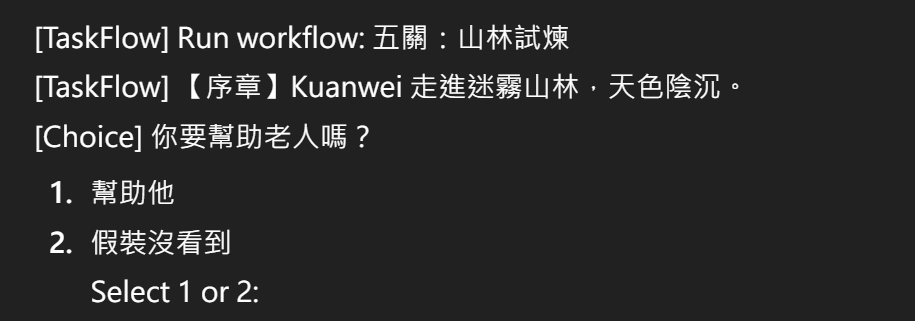

# TaskFlow (Workflow DSL) - Java 17 Minimal Interactive Workflow Engine

這是一個「資料驅動流程引擎」的最小教學示範：  
用 XML 描述流程（DSL），用 XSD 驗證資料正確性，Java 引擎負責執行（含互動 choice）。

本專案目前提供 Console 互動版本，未來可無痛替換為 LibGDX UI / Android UI 的 Presenter。

---

## 特色

- **DSL（XML）**：流程寫在資料裡，不把分支/關卡寫死在程式碼
- **Validation（XSD）**：載入期就擋掉不合法 XML（fail-fast）
- **Engine（Java）**：以 state（variables）+ tasks（TaskDefinition）執行流程
- **互動 choice**：在 Console 透過輸入 1/2 進行選擇（Presenter 可替換）
- **可擴充 task type**：新增任務只要擴充 XSD + Engine switch

---

## 目前支援的 task type

| type    | 用途 |
|--------|------|
| setVar  | 寫入變數（state） |
| log     | 印出訊息（支援 `${var}` 插值） |
| choice  | 顯示兩個選項，使用者選擇後寫入變數 |
| branch  | 根據變數值跳轉到 thenGo / elseGo |
| goto   | 無條件跳轉 |
| end    | 結束流程 |

---

## 專案結構（重點）

- `core/src/main/java/.../TaskFlowTutorial.java`  
  最小教學版（log + setVar + branch + end）
- `core/src/main/java/.../TaskFlowInteractiveExample.java`  
  互動版（加入 choice + goto + Presenter）
- `core/src/main/resources/workflow.xsd`  
  DSL 的 schema 驗證
- `core/src/main/resources/xml/task2.xml`  
  五關互動示範流程（中文劇情）

---

## 如何執行

### 方式 1：Gradle 執行 main

以你目前的設定為例：

- `:core:TaskFlowInteractiveExample.main()`

執行後會看到類似輸出：

### 方式 2：IDE / AS 直接 Run main

直接執行：

- `TaskFlowInteractiveExample.main()`

---

## DSL 設計說明（核心概念）

### 1) Workflow 是「task 清單」
- 預設從第一個 `<task>` 開始跑
- `branch/goto/end` 會改變流程走向
- 其他任務（log/setVar/choice）預設走「下一個 task」

### 2) 分支後務必「匯合」
因為流程預設順序向下執行，  
所以分支路徑結尾要 `goto` 回到共同節點（join point），避免「串線」。

---

## Presenter 抽象（未來接 UI 的關鍵）

互動選擇並沒有綁死 Console，而是透過：

- `ChoicePresenter.showTwoOptions(...)`

Console 版本只是其中一個實作：

- `ConsoleChoicePresenter`

你可以改成：
- LibGDX Dialog / Scene2D Button
- Android AlertDialog
- Web UI（如果未來要上雲）

---

## 下一步可擴充方向（建議）

- **Loader 健全性檢查**：驗證 `goto/branch` 的目標 taskId 是否存在
- **多選項 choice**：支援 3+ 選項、動態選項清單
- **條件運算**：branch 支援 `> < contains` 等（expression）
- **型別系統**：variables 支援 boolean/int/string
- **非同步等待**：讓 `choice` 回傳 WAIT，等 UI callback 再 resume

---

